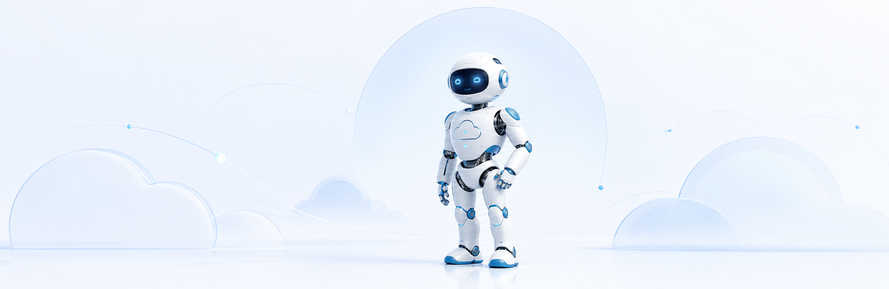

  

 

# Samet ER

### Salesforce · Enterprise Software · AI Automation

I design thoughtful software where **cloud, data, and business operations** meet.

 

&nbsp;

&nbsp;

 

## Building systems that feel simple.

I'm a full-stack developer focused on **Salesforce solutions, enterprise integrations, CRM/ERP platforms, and intelligent automation**. I turn complex operational workflows into clear, reliable, and maintainable products.

- Salesforce development with **Apex, Sales Cloud, automation, and integrations**
- Enterprise applications with **C#, .NET, Java, JavaScript, and PHP**
- CRM, ERP, retail, POS, and data synchronization architectures
- API-first systems designed around real business processes

 

## Salesforce

| Platform engineering | Integration | Automation |
| :--- | :--- | :--- |
| Apex development | REST APIs | Business workflows |
| Sales Cloud solutions | CRM & ERP synchronization | Process automation |
| Data modeling | External systems | Intelligent agents |

 

## Core expertise

|  | Language | Ecosystem |
| :---: | :--- | :--- |
| ☁️ | **Apex** | Salesforce · Sales Cloud · SOQL · Lightning |
| ◼︎ | **C#** | .NET · ASP.NET Core · Windows Applications |
| ◆ | **JavaScript** | Node.js · React · Next.js · Express |
| ● | **PHP** | Laravel · REST APIs · MySQL |
| ◇ | **Java** | Spring Boot · Enterprise Applications |

### Also working with

`HTML5` · `CSS3` · `TypeScript` · `Python` · `PowerShell` · `SQL` · `Git` · `Docker` · `REST` · `JSON`

 

## Selected work

### ReSoft Adaptive CRM

An adaptive CRM and retail ERP platform with **Salesforce Sales Cloud integration**, connecting customer data, operational processes, and enterprise workflows.

[View project →](https://github.com/aptus0/Re)

---

### SAMER Hub

A Windows-based integration platform for restaurants, cafés, markets, and takeaway businesses—bringing POS, orders, tables, cash registers, and invoicing into one operational flow.

[View project →](https://github.com/aptus0/INF-5000F-Pos-Tracking)

---

### Network Manager

A focused Windows utility for managing communication between PCs and POS devices.

[View releases →](https://github.com/aptus0/Network-Manager-Releases)

 

## Engineering principles

> **Clarity over complexity.**  
> Reliable integrations. Thoughtful interfaces. Software built around people and operations.

 

  

**Bursa, Türkiye** &nbsp;·&nbsp; Open to Salesforce and enterprise software collaborations

 

[Website](https://temasre.shop) &nbsp;&nbsp; [GitHub](https://github.com/aptus0)

 

Designed with simplicity. Engineered for impact.

